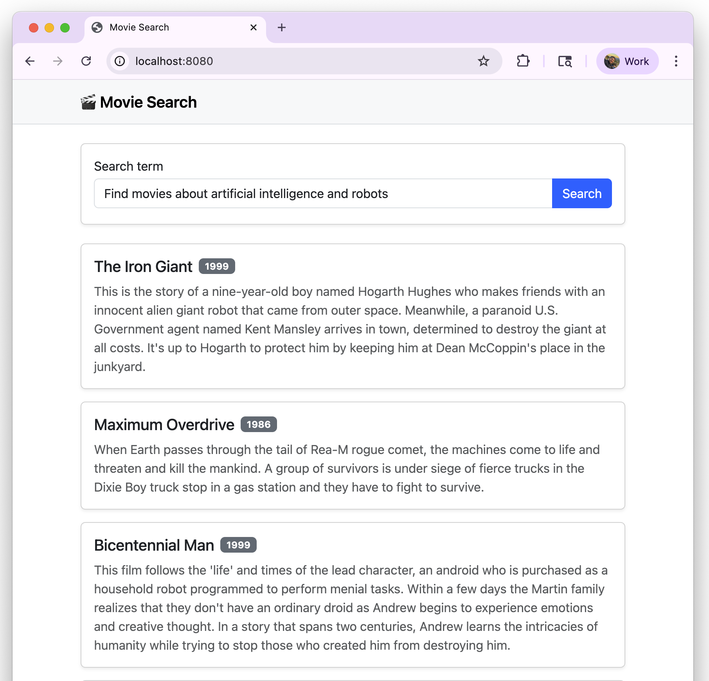

# spring-data-mongodb-vector-search
Semantic movie search using Spring Boot, Spring Data MongoDB (Vector Search), and Voyage AI embeddings.
Includes a minimal Bootstrap UI served by Spring (/static/index.html) and a REST endpoint.


## Built With

- Java 21
- Spring Boot Starter Data MongoDB 3.5.4
- [Spring Cloud OpenFeign 4.3](https://spring.io/projects/spring-cloud-openfeign)
- [MongoDB Atlas](https://www.mongodb.com/cloud/atlas/register) 
- [Voyage AI Embeddings API](https://www.voyageai.com/)
- Bootstrap 5 (simple UI)

## Getting Started
### 1. Clone the repository

```bash
git clone https://github.com/mongodb-developer/spring-data-mongodb-vector-search.git
```

### 2. Set the environments variables
```
cd spring-data-mongodb-vector-search
export MONGODB_URI="<YOUR_CONNECTION_STRING>" VOYAGE_API_KEY="<API_KEY>"
```

### 3. Run the application
```
mvn spring-boot:run
```

#### 3.1 Use the API (endpoint):

```
GET localhost:8080/movies?query=Find movies featuring pyramids and space travel
```

#### Or Open the app
```
http://localhost:8080/
```
Use the search bar to find movies (renders title, year, and full plot).

 


 
 